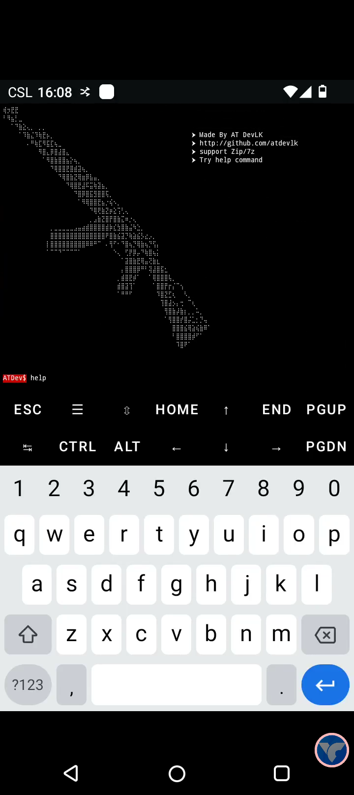

# atArchive

This command-line tool tests the strength of password-protected ZIP and 7z archives using dictionary and numeric-based methods. It is intended for educational and security research purposes only, helping users evaluate password weaknesses and understand the importance of strong password practices

<p align="center">
  
</p>

<h2>installation: </h2>

<p>Step 1</p>

  ```
  pkg update && pkg upgrade
  ```
<p>Step 2</p>

```
pkg install zip && pkg install p7zip
```
<p>Step 3</p>

```
git clone https://github.com/atdevlk/atArchive.git
```
<h2>Usage: </h2>

<p>Folder</p>

```
cd at-Archive
```
<p>Permission</p>

```
chmod +x *
```
<p>Start</p>

```
./start
```
<p>Next</p>

```
help
```
